## 其他

### GAN

#### pix2pix（pix2pixHD）

##### 网络结构 

 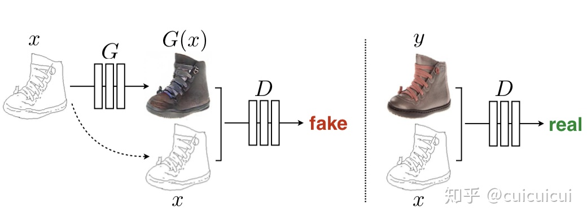 
 

 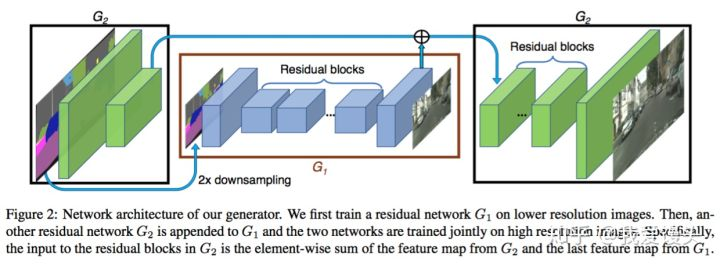 
 

 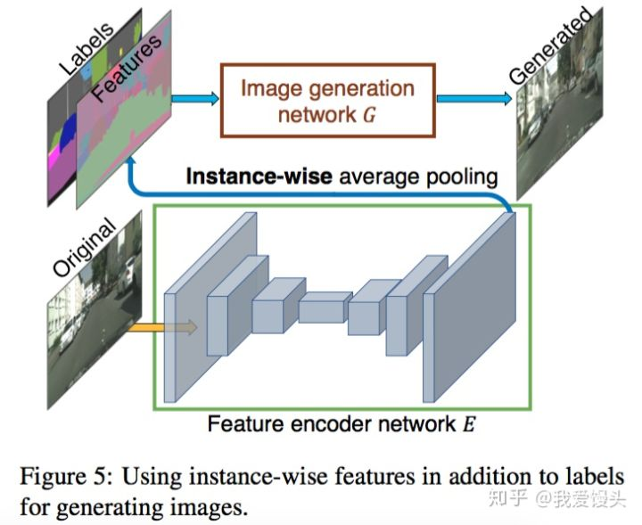 
 

**pix2pix**

输入就是条件信息。原始的CGAN需要输入随机噪声，以及条件。这里之所有没有输入噪声信息，是因为在实际实验中，如果输入噪声和条件，噪声往往被淹没在条件C当中，所以这里直接省去了.

**PatchGAN**

将图像换分成很多个Patch，并对每一个Patch使用判别器进行判别（实际代码实现有更取巧的办法，实际是这样实现的：假设输入一张256x256的图像到判别器，输出的是一个4x4的confidence map，每一个像素值代表当前patch是真实。

**pix2pixHD**

生成器由两部分组成，G1和G2，其中G2又被割裂成两个部分。G1和pix2pix的生成器没有差别，就是一个end2end的U-Net结构。G2的左半部分提取特征，并和G1的输出层的前一层特征进行相加融合信息，把融合后的信息送入G2的后半部分输出高分辨率图像。

判别器使用多尺度判别器，在三个不同的尺度上进行判别并对结果取平均。判别的三个尺度为：原图，原图的1/2降采样，原图的1/4降采样（实际做法为在不同尺度的特征图上进行判别，而非对原图进行降采样）。

**语义编辑**

语义编辑
不同于pix2pix实现生成多样性的方法（使用Dropout），这里采用了一个非常巧妙的办法，即学习一个条件(Condition)作为条件GAN的输入，不同的输入条件就得到了不同的输出，从而实现了多样化的输出，而且还是可编辑的。

**loss**

GAN loss：和pix2pix一样，使用PatchGAN。

Feature matching loss：将生成的样本和Ground truth分别送入判别器提取特征，然后对特征做Element-wise loss

Content loss：将生成的样本和Ground truth分别送入VGG16提取特征，然后对特征做Element-wise loss

**使用Instance-map的图像进行训练**

Boundary map:根据个体分割的结果求出Boundary map

将Boundary map与输入的语义标签concatnate到一起作为输入 。Boundary map求法很简单，直接遍历每一个像素，判断其4邻域像素所属语义类别信息，如果有不同，则置为1。

#### cycleGAN(starGAN)

##### 网络结构 

 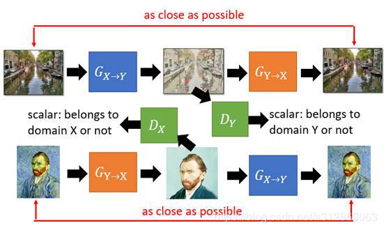 
 

     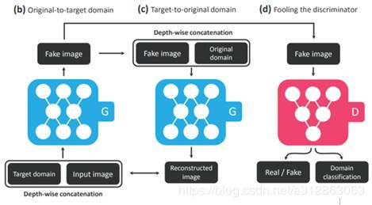

**Cycle GAN**

pix2pix需要成对图片训练，CycleGAN解决了这个问题，可以不成对，但要同类！

将一类图片转换成另一类图片。

X domain--(G1)-->Y domain--(G2)-->X domain，还会有Y domain--(G2)-->X domain--(G1)-->Y domain

Cycle Consistency 损失

**starGAN**

在n个domain当中互转。

对于discriminator，它的输入是一张图片，它需要去鉴别出这张图片是真实图片还是generator产生的图片，同时它还需要分辨出这张输入的图片来自于哪个domain(哪种风格)。

对于generator，它有两个输入，分别是目标domain和输入图片，它的输出是一张符合目标domain风格的图片。

对抗损失，使用了wgan损失

####GAN-SRGAN（ESRGAN）

#####网络结构

 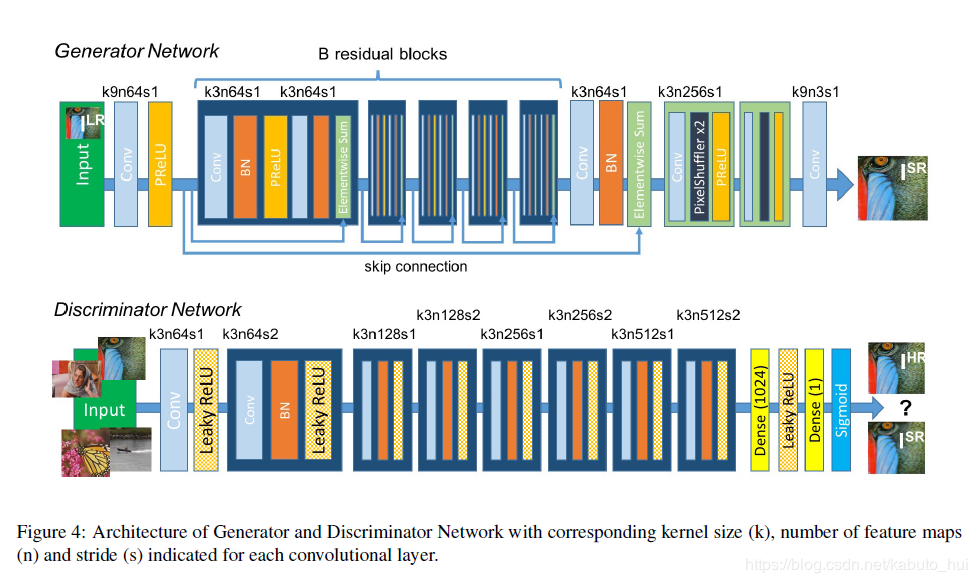 
 

 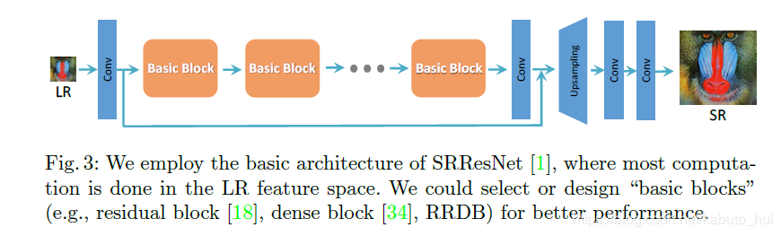 
 

 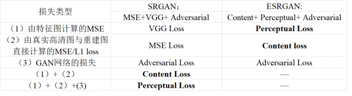 
 

**SRGAN**

GAN的生成器是残差块+卷积层+BN层+ReLU，判别器就是VGG+LeakyReLU+max-pooling

SRGAN利用感知损失（perceptual loss）和对抗损失（adversarial loss）来提升输出图像的真实感。

感知损失（perceptual loss）：利用CNN提取的特征，通过比较生成图片经过CNN后的特征和目标图片经过CNN后的特征差别，使得生成的图片和目标图片在语义上更加相似。感知损失优化的是超分辨率模型的特征空间而不是像素空间。

**ESRGAN**

生成器:

1.在生成器中移除了所有的BN层；
2.用RRDB(Residual in Residual Dense Block)代替原来SRGAN中的Residual Block

判别器:

使用RaD(Ralativistic average discriminator)代替标准的判别器

关于感知损失（Perceptual Loss）的改进

1.使用的特征图是VGG19网络中激活之前的卷积层输出；
    原因一：经过激活之后特征变得非常稀疏；
    原因二：经过激活后会造成与原图不一样的重构亮度
2.引入L1正则化

网络插值（Network Interpolation）
先训练一个面向PSNR的GAN(损失函数是L1 loss)，然后在训练一个普通的GAN（pixel-wise loss，就是L2损失函数）。然后融合两个网络的参数。

训练：

1.采用L1损失函数训练PSNR-oriented的网络，再将这个网络参数作为生成器的初始化参数；

2.采用改进之后的感知损失函数进行训练；

3.在采用pixel-wise loss（基于L2损失函数）训练一个GAN-based的网络，然后再将这个网络参数作为生成器的初始化参数；

4.再采用改进之后的感知损失函数进行训练；
5.最后采用网络插值的方式进行融合。

### 人脸人体

#### MTCNN

MTCNN: Multi-task convolutional neural network（多任务卷积神经网络）

构建图像金字塔:首先将图像进行不同尺度的变换，构建图像金字塔，以适应不同大小的人脸的进行检测。

 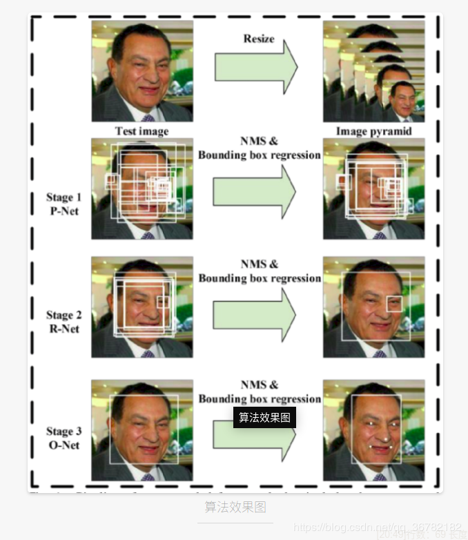 
 

     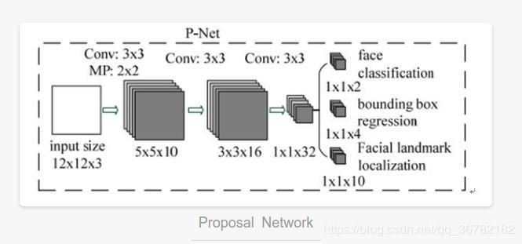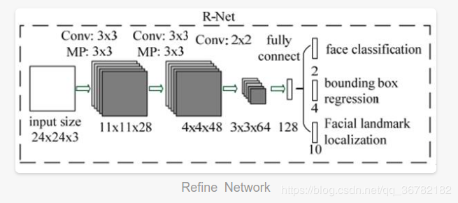 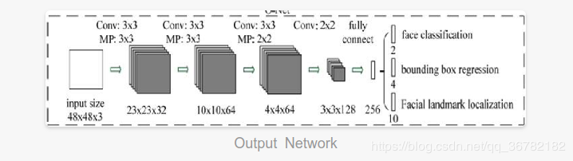

#####网络结构

**P-Net**

人脸区域的区域建议网络，特征输入结果三个卷积层之后，通过一个人脸分类器判断该区域是否是人脸，同时使用边框回归和一个面部关键点的定位器来进行人脸区域的初步提议，最终输出很多张可能存在人脸的人脸区域，R-Net进行进一步处理。

使用较为浅层、较为简单的CNN快速生成人脸候选窗口。全卷积输出的1x1x32的特征。

**R-Net**

对输入进行细化选择，并且舍去大部分的错误输入，并再次使用边框回归和面部关键点定位器进行人脸区域的边框回归和关键点定位，输出较为可信的人脸区域。R-Net使用在最后一个卷积层之后使用了一个128的全连接层，保留了更多的图像特征，准确度性能也优于P-Net。

使用一个相对于P-Net更复杂的网络结构来对P-Net生成的可能是人脸区域区域窗口进行进一步选择和调整，从而达到高精度过滤和人脸区域优化的效果。

**O-Net**

输入特征更多，在网络结构的最后同样是一个更大的256的全连接层，保留了更多的图像特征，同时再进行人脸判别、人脸区域边框回归和人脸特征定位，最终输出人脸区域的左上角坐标和右下角坐标与人脸区域的五个特征点,这一层的输出作为最终的网络模型输出。

#### RetinaFace

#####网络结构

人脸关键点的损失来辅助训练 + 一个所谓自监督学习的分支( 进行2D到3D的编码与解码，同时计算进行解码编码还原后的五个人脸关键点的损失)

**Dense Regression Branch**

将2D的人脸映射到3D模型上，再将3D模型解码为2D图片，然后计算经过编解码的图片和原始图片的差别。中间用到了图卷积

ResNet152的金字塔结构，对于每一层金字塔都有特定的Anchor Setting，据说这样可以捕捉到不同的信息， 

P2用于设置为捕微小人脸的功能。中间还使用了OHEM来平衡positive 和negative的anchors，因为negative anchors的数量明显要多。同时对小人脸数据集做了Resize以增量训练

#### 人脸识别loss 

#### 原理 

triplet loss 

center loss 

W&F Norm softmax 

SphereFace 

CosineFace

ArcFace

#### PFLD

##### 网络结构

融合三个不同尺度的特征,网络结构骨干部分采用的是Mobilenet-v2

**损失函数设计**

wn为可调控的权值函数（针对不同的情况选取不同的权值，如正常情况、遮挡情况、暗光情况等等），theta为人脸姿态的三维欧拉角（K=3），d为回归的landmark和groundtrue的度量（一般情况下为MSE，也可以选L1度量）

设计的目的是，对于样本量比较大的数据（如正脸，即欧拉角都相对较小的情况），给予一个小的权值，在进行梯度的反向传播的时候，对模型训练的贡献小一些；对于样本量比较少的数据（侧脸、低头、抬头、表情极端），给予一个较大的权值。

**配合训练的子网络**

辅助训练子网络,输入 PFLD主网络的中间输出，对该样本进行三维欧拉角的估计，其groundtruth由训练数据中的关键点信息进行估计，作为区分数据分布的依据

