###  ResNet：

构建恒等映射:解决网络退化问题

#### 网络结构：

  
 

	class ResNet(nn.Module):
	    def forward(self, x):
	        # 输入
	        x = self.conv1(x)
	        x = self.bn1(x)
	        x = self.relu(x)
	        x = self.maxpool(x)
	
	        # 中间卷积
	        x = self.layer1(x)
	        x = self.layer2(x)
	        x = self.layer3(x)
	        x = self.layer4(x)
	
	        # 输出
	        x = self.avgpool(x)
	        x = x.view(x.size(0), -1)
	        x = self.fc(x)
	
	        return x
	
	# 生成一个res18网络
	def resnet18(pretrained=False, **kwargs):
	    model = ResNet(BasicBlock, [2, 2, 2, 2], **kwargs)
	    if pretrained:
	        model.load_state_dict(model_zoo.load_url(model_urls['resnet18']))
	    return model

输入部分、输出部分和中间卷积部分（中间卷积部分包括如图所示的Stage1到Stage4共计四个stage）

网络之间的不同主要在于中间卷积部分的block参数和个数存在差异

  
 

**残差块:**

 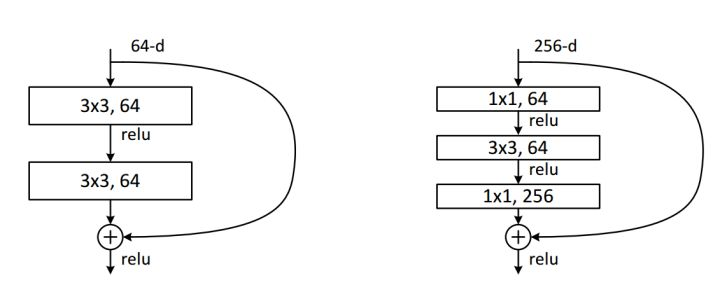 
 

basic-block：

Bottleneck：使用了1x1卷积的bottleneck将计算量简化为原有的5.9%

**常见改进：**

 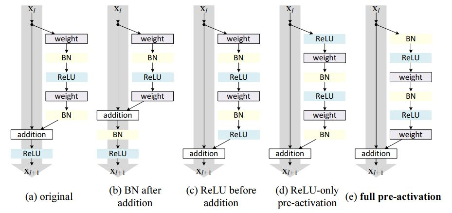 
 

改进downsample部分，减少信息流失：下采样后移

ResNet部分组件的顺序进行了调整：如果将ReLU放在原先的位置，那么残差块输出永远是非负的，这制约了模型的表达能力。ReLU移入了残差块内部。

#### 设计特点：

如果特征地图大小减半，滤波器的数量加倍以保持每层的时间复杂度

每个stage通过步长为2的卷积层执行下采样，而却这个下采样只会在每一个stage的第一个卷积完成，有且仅有一次。

最大池化与平均池化： 网络以平均池化层和softmax的1000路全连接层结束，实际上工程上一般用自适应全局平均池化 (Adaptive Global Average Pooling)，好处：一是节省计算资源，二是防止模型过拟合，提升泛化能力。更保险的操作，就是最大池化和平均池化都做，然后把两个张量拼

###   Resnext

ResNeXt：ResNet + Inception，split-transform-merge

#### 网络结构：

 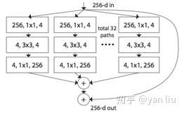 
 

ResNeXt的分支的拓扑结构是相同的，Inception V4需要人工设计

ResNeXt是先进行1X1卷积然后执行单位加，Inception V4是先拼接再执行 1X1 卷积

#### 设计特点：

分组卷积： 介于普通卷积核深度可分离卷积的

###   Res2Net

在更细粒度的水平上利用了多尺度

#### 网络结构：

 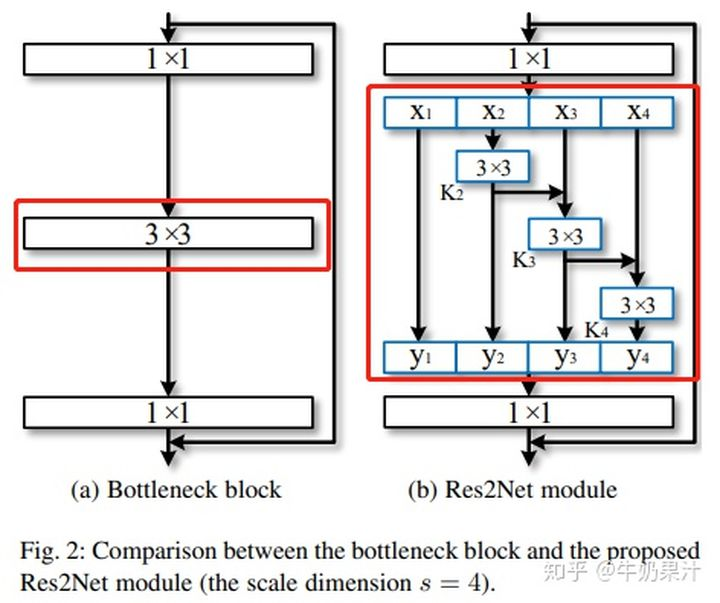 
 

y1=x1

y2=K2(x2)

y3=K3(x3+y2) = K3(x3+K2(x2))

y4=K4(x4+y3) = K4(x4+K3(x3+K2(x2)))

由于这种拆分混合连接结构，Res2Net模块的输出包含不同感受野大小的组合，该结构有利于提取全局和本地信息

###  ResNeSt

Split-Attention Networks，主要： Multi-path 和 Feature-map Attention思想

#### 网络结构：

 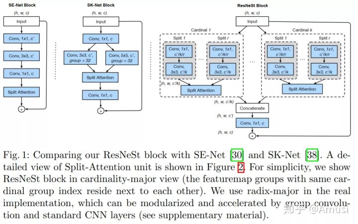 
 

Multi-path：GoogleNet、ResNeXt

SE-Net： 通过自适应地重新校准通道特征响应来引入通道注意力（channel-attention）

SK-Net： 通过两个网络分支引入特征图注意力（feature-map attention）

**训练技巧**

Large Mini-batch Distributed Training

Label Smoothing

Auto Augmentation

Mixup Training

Large Crop Size

Regularization

### Inception

Inception v1：多个filter size, 定位不同size的object,GoogLeNet（Inception v1）

Inception v2:  5*5 filter换成了俩个3*3, 3*3 filter换成了1*3+3*1

Inception v4: 修改了Inception的Stem ,添加了Reduction block

#### 网络结构：

 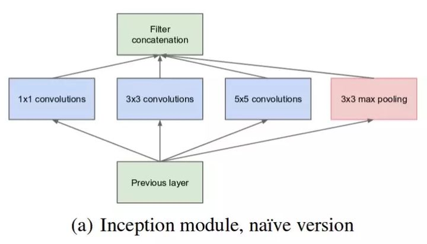 
 

  
 

### MobileNet

深度可分离卷积: 深度卷积 + 逐点卷积

#### 网络结构：

**MobileNet V1：**

 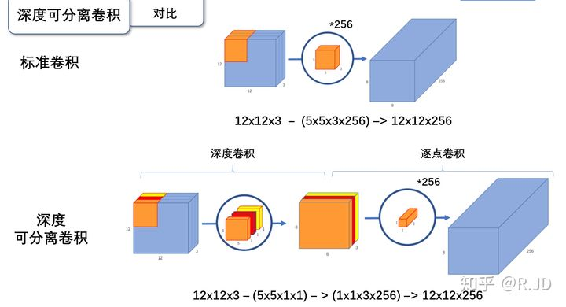 
 

 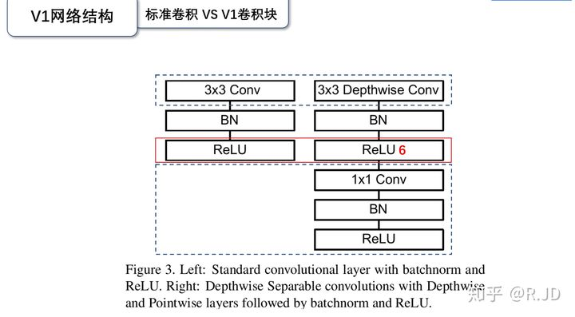 
 

卷积层： 首先使用3×3的深度卷积提取特征，接着是一个BN层，随后是一个ReLU层，在之后就会逐点卷积，最后就是BN和ReLU。

参数量：

    标准卷积： Dk×Dk×M，一共有N个

    深度卷积的卷积核尺寸Dk×Dk×M；逐点卷积的卷积核尺寸为1×1×M，一共有N个

relu问题: 对低维度做ReLU运算，很容易造成信息的丢失。而在高维度进行ReLU运算的话，信息的丢失则会很少.将ReLU替换成线性激活函数

Linear bottleneck: 最后的那个ReLU6换成Linear。

Expansion layer：PW逐点卷积也就是1×1卷积可以用来升维和降维，那就可以在DW深度卷积之前使用PW卷积进行升维（升维倍数为t，t=6），再在一个更高维的空间中进行卷积操作来提取特征。

**MobileNet V2：**

 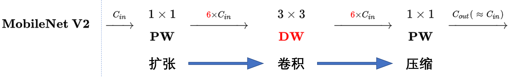 
 

 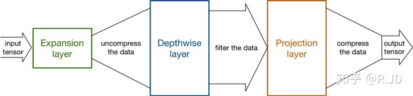 
 

 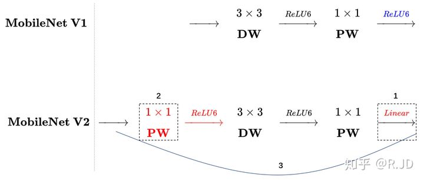 
 

  
 

 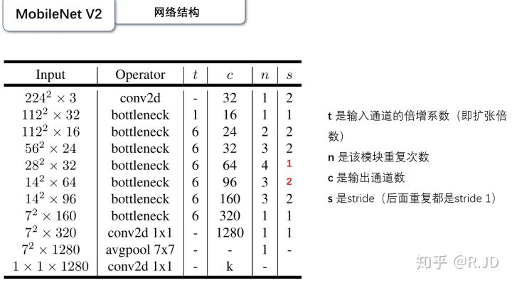 
 

Inverted residuals：引入shortcut结构，

    ResNet 先降维 (0.25倍)、卷积、再升维。
    MobileNetV2 则是 先升维 (6倍)、卷积、再降维。

**MobileNet V3：**

  
 

  
 

  
 

网络的架构基于NAS实现的MnasNet，资源受限的NAS（platform-aware NAS）与NetAdapt

    资源受限的NAS，用于在计算和参数量受限的前提下搜索网络来优化各个块（block），所以称之为模块级搜索（Block-wise Search） 。

    NetAdapt，用于对各个模块确定之后网络层的微调每一层的卷积核数量，所以称之为层级搜索（Layer-wise Search）

引入基于squeeze and excitation结构的轻量级注意力模型(SE）

新的激活函数h-swish(x)：Swish具备无上界有下界、平滑、非单调的特性，基于ReLU6设计近似函数逼近Swish。

修改了MobileNetV2网络端部最后阶段：保留高维特征的前提下减小延时

### Senet

Squeeze-and-Excitation (SE)

#### 网络结构

 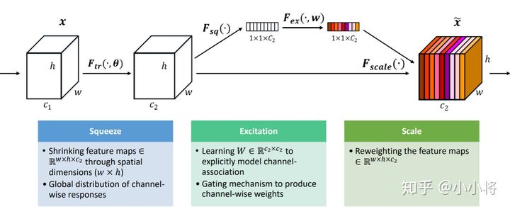 
 

 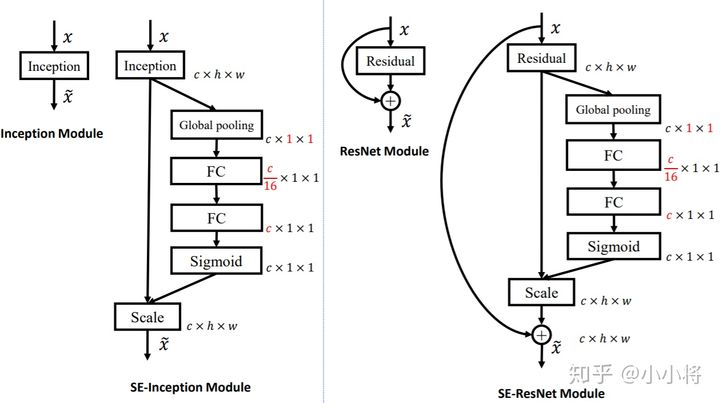 
 

    class SELayer(nn.Module):
        def __init__(self, channel, reduction=16):
            super(SELayer, self).__init__()
            self.avg_pool = nn.AdaptiveAvgPool2d(1)
            self.fc = nn.Sequential(
                nn.Linear(channel, channel // reduction, bias=False),
                nn.ReLU(inplace=True),
                nn.Linear(channel // reduction, channel, bias=False),
                nn.Sigmoid()
            )

        def forward(self, x):
            b, c, _, _ = x.size()
            y = self.avg_pool(x).view(b, c)
            y = self.fc(y).view(b, c, 1, 1)
            return x * y.expand_as(x)
        
Squeeze：将一个channel上整个空间特征编码为一个全局特征，采用global average pooling来实现       
        
Excitation操作：抓取channel之间的关系：sigmoid形式的gating机制 ---> 学习到的各个channel的激活值（sigmoid激活，值0~1）乘以U上的原始特征

### SqueezeNet

Fire module： squeeze（1x1） + expand（1x1 3X3）

#### 网络结构
  
 
  
 

 
 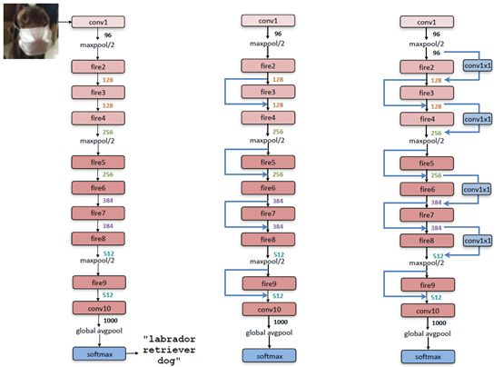 
 

（1）大量使用1x1卷积核替换3x3卷积核，因为参数可以降低9倍；

（2）减少3x3卷积核的输入通道数（input channels），因为卷积核参数为：(number of input channels) * (number of filters) * 3 * 3.

（3）延迟下采样（downsample），前面的layers可以有更大的特征图，有利于提升模型准确度。目前下采样一般采用strides>1的卷积层或者pool layer。

#### 设计特点

han网络设计总结：

（1）模型压缩：对pre-trained的模型进行压缩，使其变成小模型，如采用网络剪枝和量化等手段；

（2）CNN微观结构：对单个卷积层进行优化设计，如采用1x1的小卷积核，还有很多采用可分解卷积（factorized convolution）结构或者模块化的结构（blocks, modules）；

（3）CNN宏观结构：网络架构层面上的优化设计，如网路深度（层数），还有像ResNet那样采用“短路”连接（bypass connection）；

（4）设计空间：不同超参数、网络结构，优化器等的组合优化。

han模型压缩：
  
  SVD： 奇异值分解
  
  网络剪枝：在weight中设置一个阈值，低于这个阈值就设为0，从而将weight变成稀疏矩阵
  
  权重共享：其实就是对一个weight进行聚类，比如采用k-means分为256类，那么对这个weight只需要存储256个值就可以了，然后可以采用8 bit存储类别索引，其中用到了codebook来实现
    
  量化：float32变成int8

### ShuffleNet

shuffleNet主要拥有两个创新点：

（1）pointwise group convolution 逐点分组卷积

（2）channel shuffle

#### 网络结构

 
 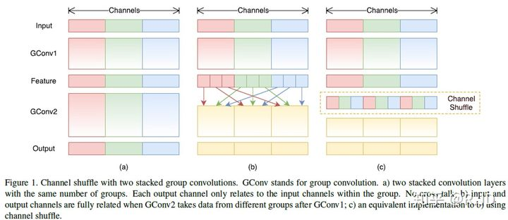 
 

 
 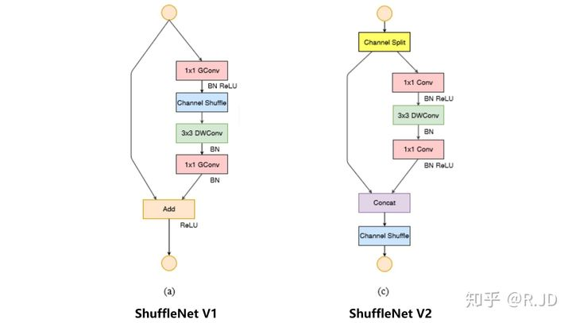 
 

FLOPS： 全大写，指每秒浮点运算次数，可以理解为计算的速度。是衡量硬件性能的一个指标。

FLOPs： s小写，指浮点运算数

torchstat： 计算pytorch构建的网络的参数，空间大小，MAdd，FLOPs

channel shuffle: 在同一组中不同的通道蕴含的信息可能是相同的，如果不进行通道交换的话，学出来的特征会非常局限。如果在不同的组之后交换一些通道，那么就能交换信息，使得各个组的信息更丰富，能提取到的特征自然就更多，这样是有利于得到更好的结果

 
 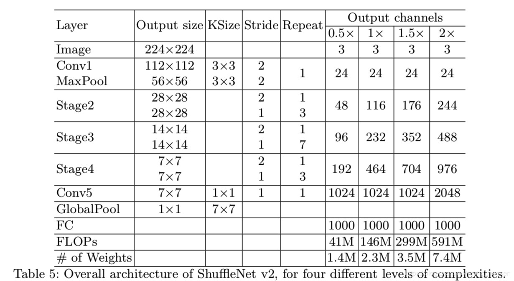 
 

v2改进： Channel split： 将c特征通道的输入被分为两支，分别带有 c−c' 和c'个通道。一个分支的结构仍然保持不变。另一个分支由三个卷积组成。

卷积之后，把两个分支拼接(Concat)起来，从而通道数量保持不变 (G1)

#### 设计特点

（1） 卷积层使用相同的输入输出通道数。

（2） 注意到使用大的分组数所带来的坏处。

（3） 减少分支以及所包含的基本单元。

（4） 减少Element-wise操作。

### EfficientNet

复合模型扩张方法结合神经结构搜索技术

#### 网络结构

 
  
 

 
  
 

 
 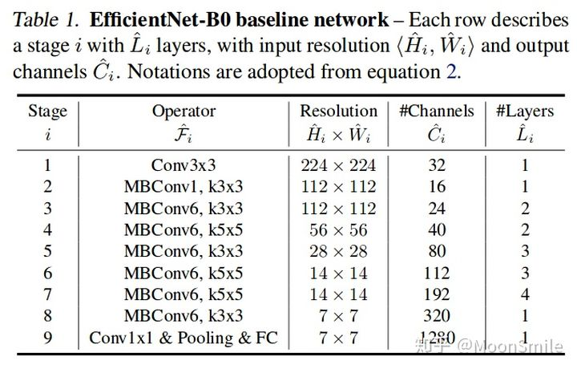 
 

MobileNet V2中的MBCConv作为模型的主干网络，同时也是用了SENet中的squeeze and excitation方法对网络结构进行了优化。

从depth, width, resolution 这三个维度去缩放模型，在ConvNet缩放过程中平衡网络宽度、深度和分辨率的所有维度是至关重要的

### hrnet

人体姿态识别这类的任务中，需要生成一个高分辨率的heatmap。

将不同分辨率的feature map进行并联，添加不同分辨率feature map之间的交互(fusion)

#### 网络结构

 
 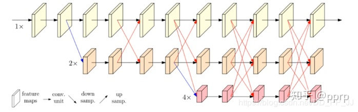 
 

a 在高分辨率特征图主网络逐渐并行加入低分辨率特征图子网络，能够保持高分辨率，而不是通过一个低到高的过程恢复分辨率，

b 利用相同深度和相似级别的低分辨率表示来提高高分辨率表示。

 
 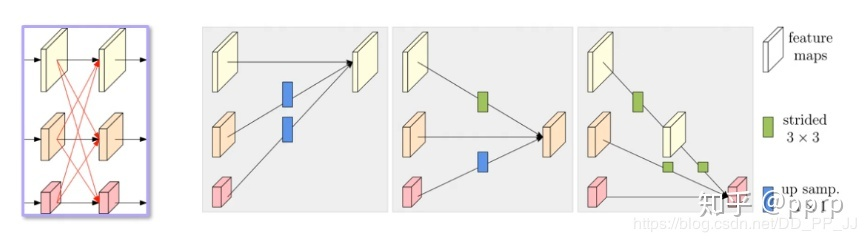 
 

**fusion方法：**

同分辨率的层直接复制。

需要升分辨率的使用bilinear upsample + 1x1卷积将channel数统一。

需要降分辨率的使用strided 3x3 卷积。

三个feature map融合的方式是相加。

strided 3x3卷积: 

卷积在降维的时候会出现信息损失，使用strided 3x3卷积是为了通过学习的方式，降低信息的损耗,没有用maxpool或者组合池化。

**不同的hrnet版本**

 
 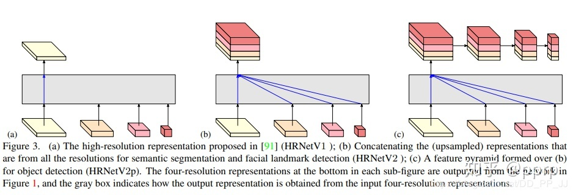 
 

 
 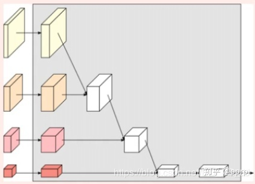 
 

(a)：HRNetV1的特征选择，只使用分辨率最高的特征图。

(b)：HRNetV2的特征选择，将所有分辨率的特征图(小的特征图进行upsample)进行concate，主要用于语义分割和面部关键点检测。

(c)：HRNetV2p的特征选择，在HRNetV2的基础上，使用了一个特征金字塔，主要用于目标检测网络。

(d) :HRNetV2采用上图的融合方式，主要用于训练分类网络

**热图估计（heatmap estimation）**

HRNet使用最后一个exchange unit中的高分辨率表示输出来进行热图估计，使用MAE作为损失函数。

**创新点**

将高低分辨率之间的链接由串联改为并联。

在整个网络结构中都保持了高分辨率的表征(最上边那个通路)。

在高低分辨率中引入了交互来提高模型性能。
