## 分割

### 语义分割

#### FCN

##### 网络结构 

  
 

**原理**

全卷积网络，进行图像进行像素级的分类，CNN最后的全连接层换成卷积层，输出的是一张已经Label好的图

FCN-8s：

下采样：多个conv和+一个max pooling 作为模块，反复叠加

上采样：首先进行pool4+2x upsampled feature逐点相加，然后又进行pool3+2x upsampled 逐点相加 ，即进行更多次特征融合

对比：FCN-32s < FCN-16s < FCN-8s，即使用多层feature融合有利于提高分割准确性

**上采样方式** 

 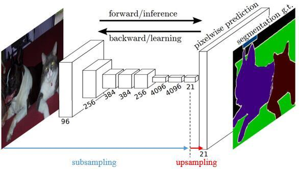 
 

Resize，如双线性插值直接缩放，类似于图像缩放（这种方法在原文中提到）

Deconvolution，也叫Transposed Convolution

upsampling的意义：将小尺寸的高维度feature map恢复回去，以便做pixelwise prediction，获得每个点的分类信息

#### U-Net

##### 网络结构

 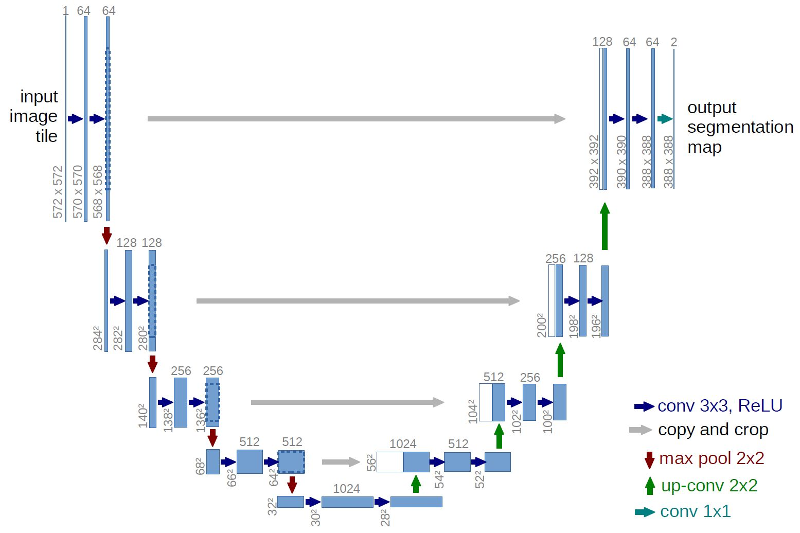 
 

  
 

**原理**

首先进行Conv+Pooling下采样；然后Deconv反卷积进行上采样，crop之前的低层feature map，进行融合；然后再次上采样。重复这个过程，直到获得输出388x388x2的feature map，最后经过softmax获得output segment map

**拼接**

U-Net采用将特征在channel维度拼接在一起，形成更“厚”的特征

特征融合：

FCN式的逐点相加，对应caffe的EltwiseLayer层，对应tensorflow的tf.add()

U-Net式的channel维度拼接融合，对应caffe的ConcatLayer层，对应tensorflow的tf.concat()

分割基本思路：

下采样+上采样：Convlution + Deconvlution／Resize

多尺度特征融合：特征逐点相加／特征channel维度拼接

获得像素级别的segement map：对每一个像素点进行判断类别

注意点：

卷积层 Padding = 0，所以每次做卷积，特征图的大小都会 -2

下采样使用 max-pooling

上采样使用步长为 2 的反卷积

分类使用 1X1 的卷积层

#### pspnet（Pyramid Scene Parsing Network）

 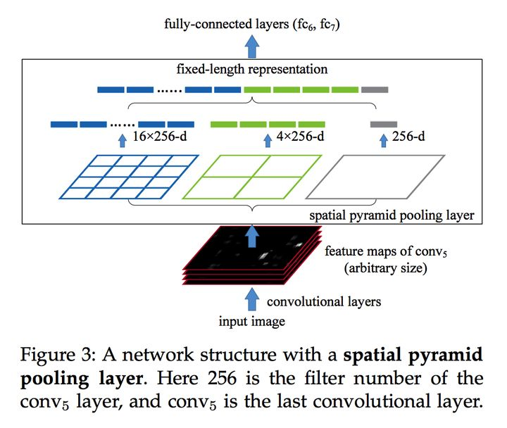 
 

 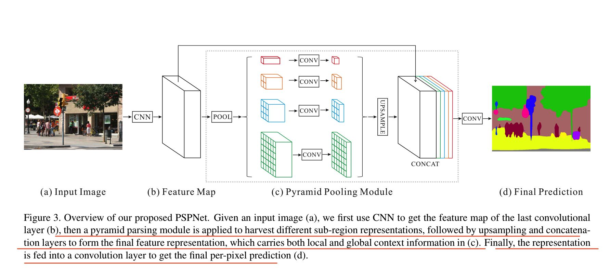 
 

##### 网络结构

**原理**

encoder: 使用了预训练的ResNet，里面使用了孔洞卷积（后面几层没有下采样，全部使用空洞卷积）。最后输出的feature map是原图的1/8

金字塔池化：使用金字塔池化模块，使用了四种尺寸的金字塔，池化所用的kerne分别1×1, 2×2, 3×3 and 6×6。池化之后上采样，然后将得到的feature map,包括池化之前的做一个级联（concatenate),后面接一个卷积层得到最终的预测图像

上采样使用双线性插值，训练使用了一个辅助的loss（中间层接出），是一个softmax loss 

#### SegNet

##### 网络结构

**原理**

 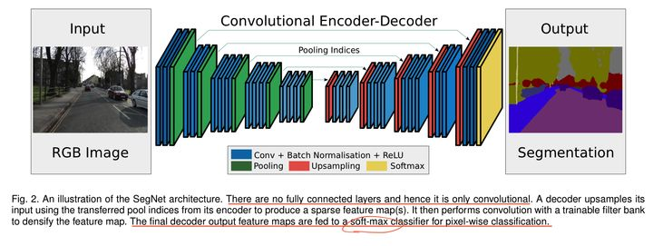 
 

 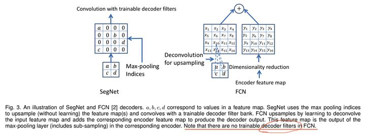 
 

Encoder编码器: 在编码器处，执行卷积和最大池化。VGG-16有13个卷积层。 （不用全连接的层） 在进行2×2最大池化时，存储相应的最大池化索引（位置）

Decoder解码器:

在解码器处，执行上采样和卷积。最后，每个像素送到softmax分类器。

在上采样期间，如上所示，调用相应编码器层处的最大池化索引以进行上采样。

最后，使用K类softmax分类器来预测每个像素的类别

####  DeepLabv1 v2

##### 网络结构

 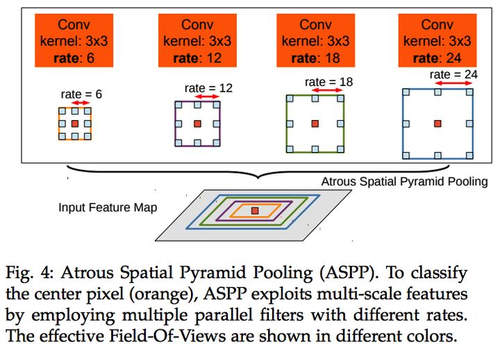 
 

**原理**

使用了空洞卷积；

提出了在空间维度上实现金字塔型的空洞池化atrous spatial pyramid pooling(ASPP)；

使用了全连接条件随机场。

####  DeepLabv3

##### 网络结构

 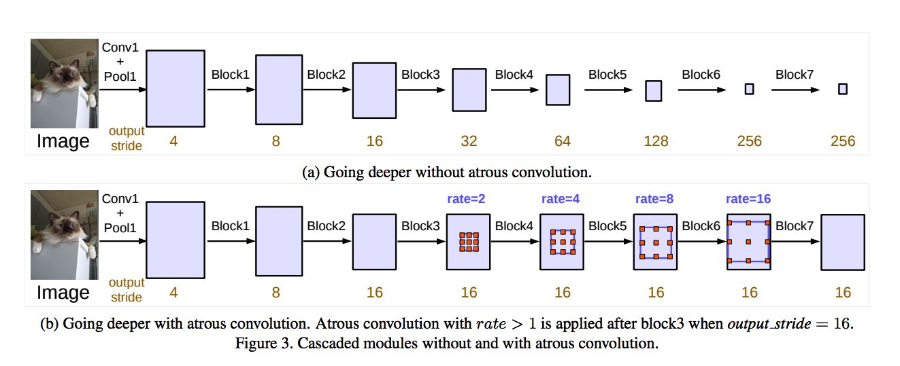 
 

  
 

使用了Multi-Grid 策略: 使用空洞卷积避免下采样太多,Block4、5、6、7 的三个 Residual Block 中，分别使用不同的 dilation rate，最佳的 rate 是 (1,2,1) 

具有不同 atrous rates 的 ASPP 能够有效的捕获多尺度信息。 同时 ASPP 加入了 全局池化层+conv1x1+双线性插值上采样 的模块（当空洞卷积的 rate 和 feature map 的大小一致时，3卷积退化为1）

### Deeplabv3+

V3+ 最大的改进是将 DeepLab 的 DCNN 部分看做 Encoder，将 DCNN 输出的特征图上采样成原图大小的部分看做 Decoder ，构成 Encoder+Decoder 体系

##### 网络结构

 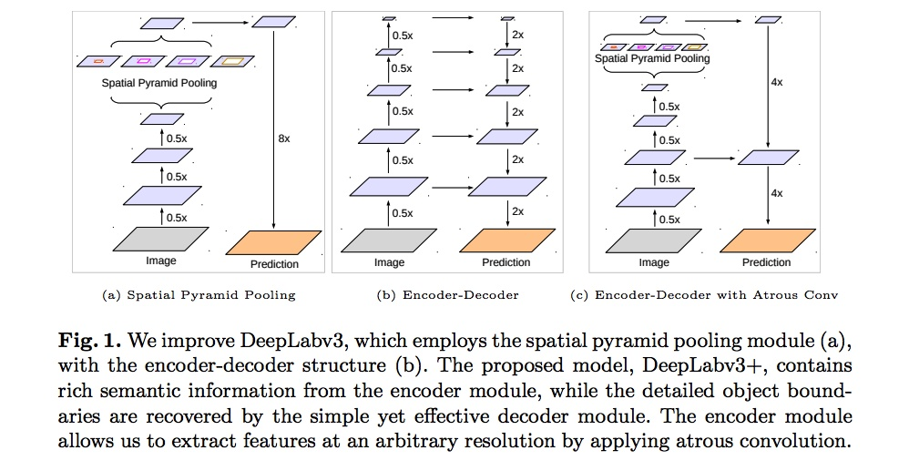 
 

 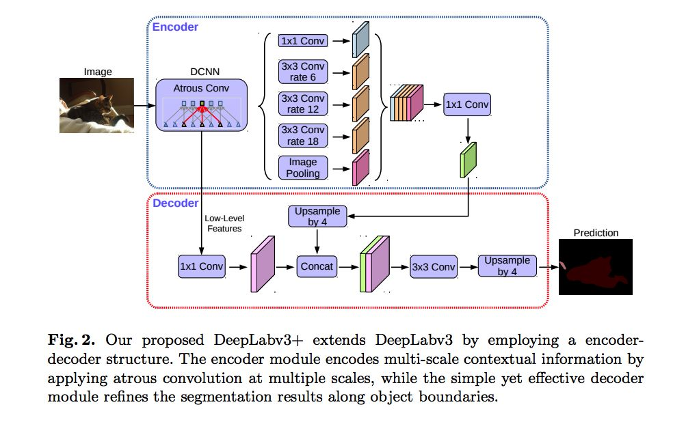 
 

DeepLabV3+ 在 stride = 16 的DeepLabv3 模型输出上采样 4x 后，将 DCNN 中 0.25x 的输出使用 1X1 的卷积降维后与之连接（concat）再使用  1X1 卷积处理后双线性插值上采样 4 倍后得到相对于 DeepLabv3 更精细的结果

### GCN：Large Kernel Matters

同步、可分离式的大卷积，在提高感受野的同时以减少参数量（GCN）

为了提高边界的分类精度，设计了边界精细化模块，可集成与网络中同步训练（BR）

##### 网络结构

 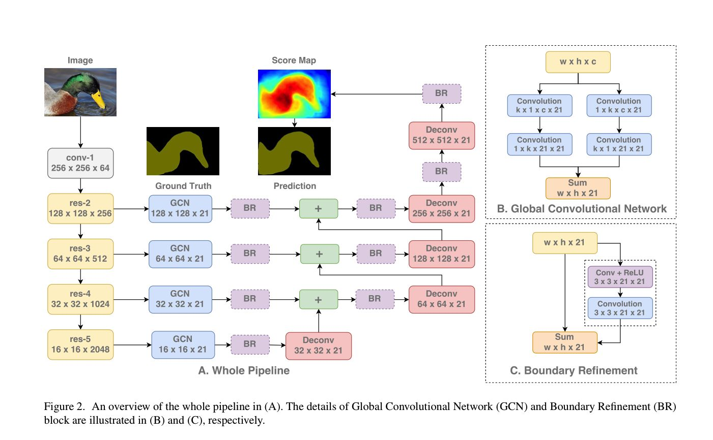 
 

 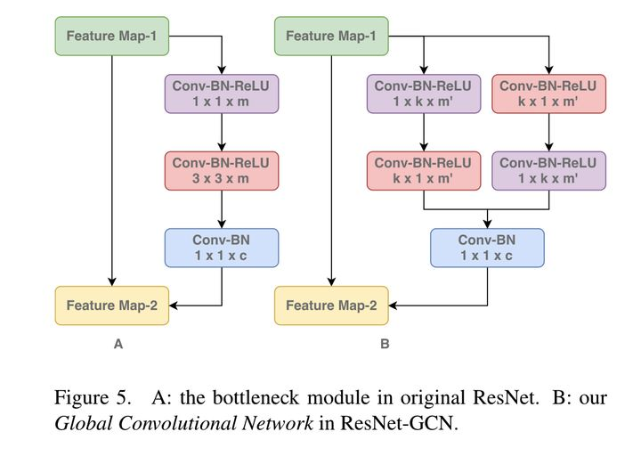 
 

设计思路： 

为了保留位置信息，不使用全局池化以及全连接层。

为了分类准确，最后的分类器应当和 CNN 提取的 feature map 联系紧密。

同时用 GCN 一样的方式修改 ResNet。

### DANet

Dual Attention Network for Scene Segmentation

引入了双注意力机制（Dual Attention），所谓双注意力，指对通道（channel）以及空间（spatial）的 Attention 机制

##### 网络结构

 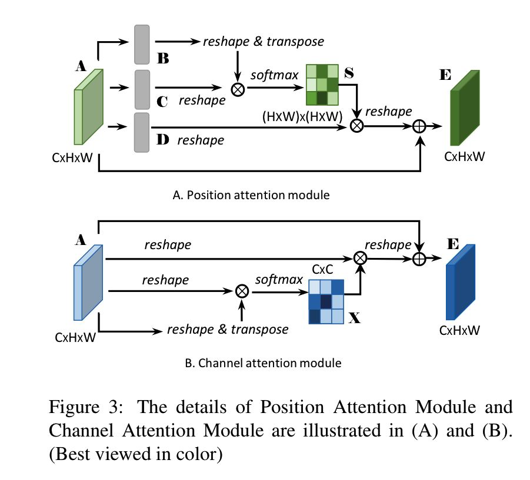 
 

  
 

