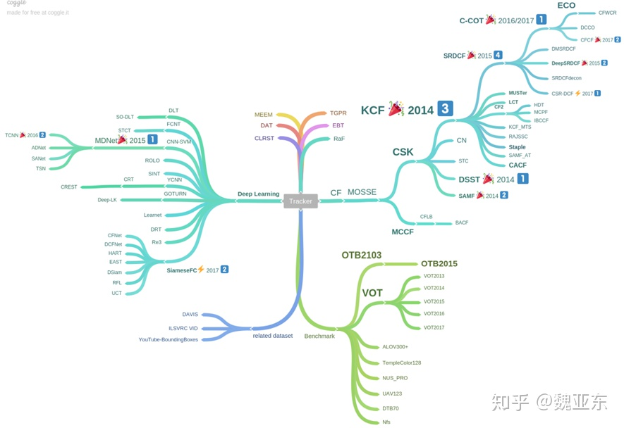
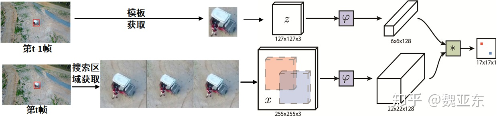
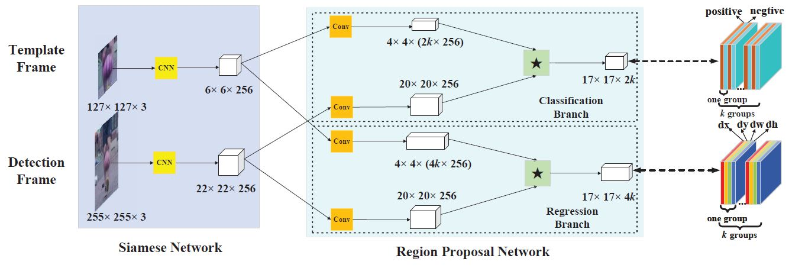
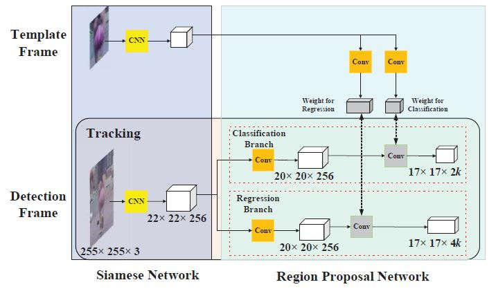
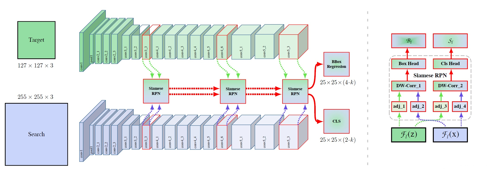
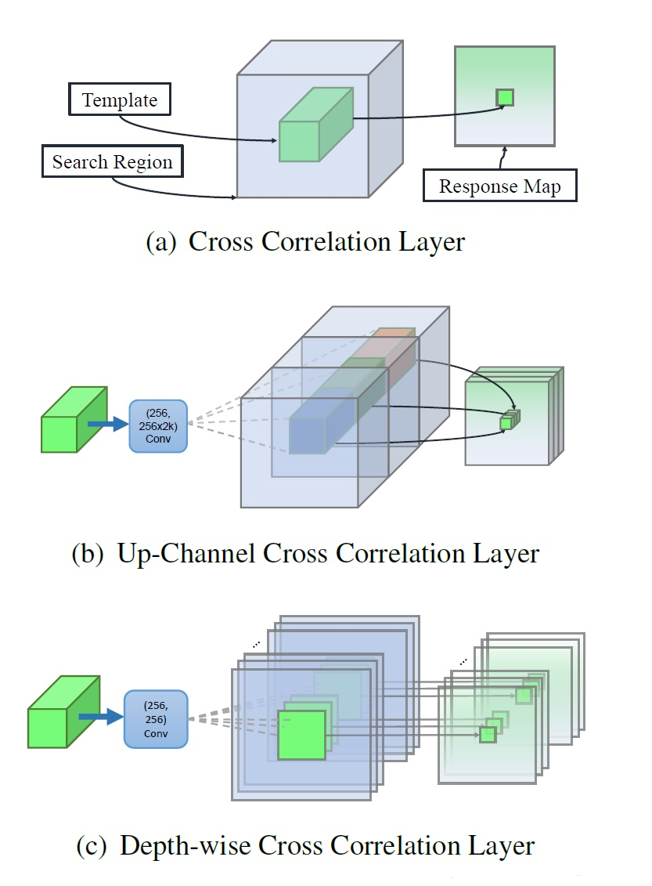
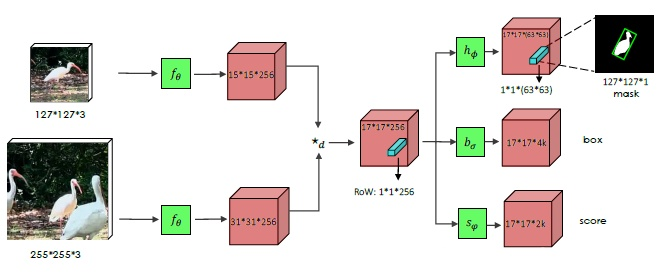
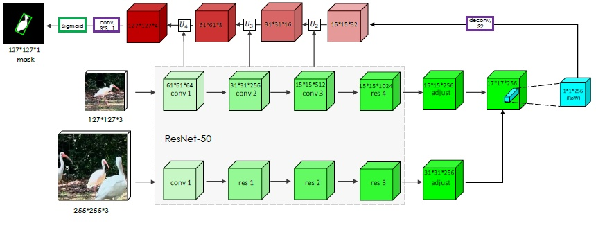

## 跟踪

  
 

#### SiamFC:

##### 网络结构 

  
 

SiameseFC的两个子体神经网络，分别输入作为跟踪目标的模板图像，和作为搜索范围的检测图像。

对于模板图像，首先统一resize到127*127*3，然后通过卷积神经层，得到一个6*6*128的输出feature map。

对于检测图像，首先统一resize到255*255*3，然后通过卷积神经层，得到一个22*22*128的输出feature map。

在经过卷积神经层提取特征后，SiameseFC使用cross-correlation（交叉相关）作为相似度的度量，计算两个feature map各个位置（区域）上的相似度，得到一个score map（或者说heat map）。最后对这个score map进行插值（这里使用的是双三线性插值），获得和原图像一样的空间分辨率，根据该score map，即可定位到跟踪目标在新一帧（检测图像）中的精确位置。

#### SiamRPN:

##### 网络结构 

  
 

  
 

SiamRPN包含用于特征提取的Siamese子网络（Siamese subnetwork）和候选区域生成网络（region proposal subnetwork），其中候选区域生成网络包含分类和回归两条支路。在跟踪阶段，SiamRPN将跟踪视作单样本检测任务（one-shot detection task）

跟踪过程：

* 输入模板帧和检测帧，分别使用Siamese网络提取特征，使用RPN生成k个proposal

* 对模板支路的proposal和检测支路的proposal做相似性度量，获得bounding box

* 使用NMS对最后预测输出的bounding box进行筛选

* 目标尺寸更新

proposal选择策略：

*  丢弃远离中心的proposal（认为相邻帧的目标位置不会发生很大的变化，而模板帧的目标是在中间的）

*  使用余弦窗和尺度变化惩罚因子对proposal进行重新排序（余弦窗和尺度变化惩罚因子是沿用了SiamFC的做法）

*  使用NMS对最后预测输出的bounding box进行筛选。

#### SiamRPN++:

##### 网络结构 

  
 

  
 

在训练过程中，SiamRPN++不再把正样本块放在图像正中心，而是按照均匀分布的采样方式让目标在中心点附近进行偏移。随着偏移的范围增大，深度网络可以由刚开始的完全没有效果逐渐变好。

**多层特征融合**

SiamRPN++选择了网络最后三个block的输出进行线性加权融合。

SiamRPN++分别在conv3_3、conv4_6和conv5_3的分支上使用siamrpn网络，并将前面siamrpn的结果输入到后面的siamrpn网络中。通过多级级联具有两个优点：

* 通过多个siamrpn来选择出多样化的样本或者具有判别性的样本块，第一个siamrpn可以去除掉一些特别简单的样本块，后面的网络进一步进行滤除，最终剩余一些hard negative sample，这样有利于提升网络的判别能力。

* 由于使用了多级回归操作，因此可以获得一个更加准确的检测框。

**Depthwise Cross Correlation**

SiamRPN++采用Depthwise Cross Correlation。

* Cross Correlation：如上图(a)所示，用于SiamFC中。模版特征在搜索区域上按照滑窗的方式获取不同位置的响应值，最终获得一个一维的响应映射图。

* Up-Channel Cross Correlation：如上图(b)所示，用于SiamRPN中。和Cross Correlation操作不同的是在做correlation操作之前多了两个卷积层，通道个数分别为256和256x2k，其中k表示每一个锚点上面的anchor个数。其中一个用来提升通道数，而另一个则保持不变。之后通过卷积的方式，得到最终的输出。通过控制升维的卷积来实现最终输出特征图的通道数。

* Depthwise Cross Correlation：如上图（c）所示，和UpChannel一样，在做correlation操作以前，模板支路和检测支路会分别通过一个非共享卷积层，但差别是不需要进行维度提升，这里只是为了提供一个非Siamese的特征。在这之后，通过类似depthwise卷积的方法，逐通道计算correlation结果，这样的好处是可以得到一个通道数非1的输出，可以在后面添加卷积就可以得到分类和回归的结果。整个过程类似于构造检测网络的头网络。

#### SiamMask:

##### 网络结构 

  
 

  
 

SiamMask是视觉目标跟踪和视频目标分割的统一框架，像是SiameseFC和MaskCNN的组合。SiamMask网络结构如图，只在Siamese网络架构中额外增加了一个Mask分支。

但是相较于预测score和box，mask的预测会更为困难。这里使用的表述方法，是利用一个vector来编码一个RoW的mask。这使得每个prediction位置具有非常高的输出维度 63X63 , 通过depthwise的卷积后级联1x1卷积来升维来实现高效运行。但直接预测的Mask分支的精度并不太高。

所以提出了如下图所示的Refine Module用来提升分割的精度，refine module采用top-down的结构。利用模板图像所在的分支，建立起一个encoder-decoder结构，然后再逐级地将语义逐渐下降、分辨率逐渐提高的模板图像的feature map与不断进行上采样的mask进行融合，最终得到同时具备高语义和高分辨率的mask。
