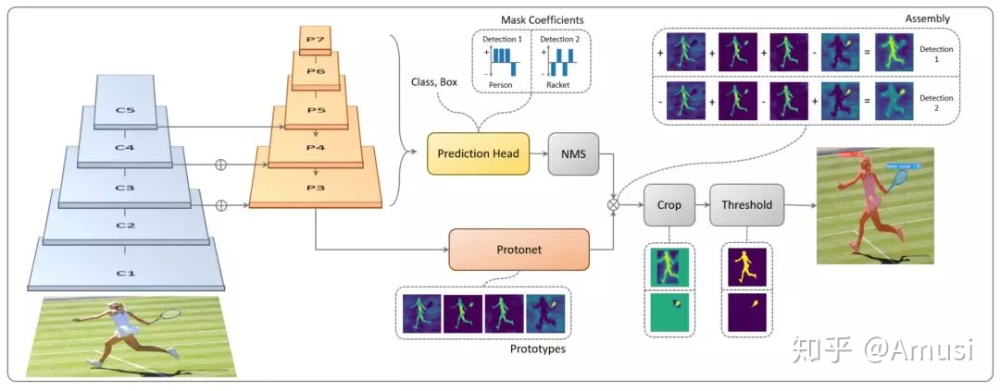
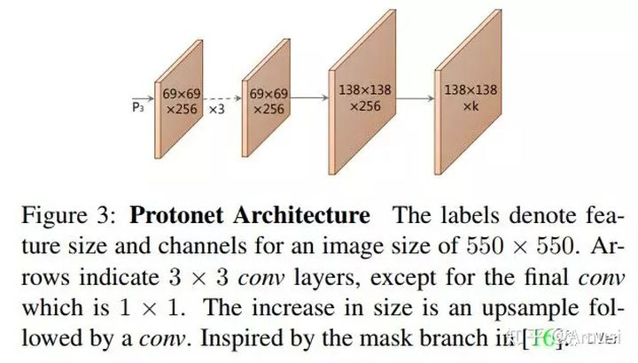
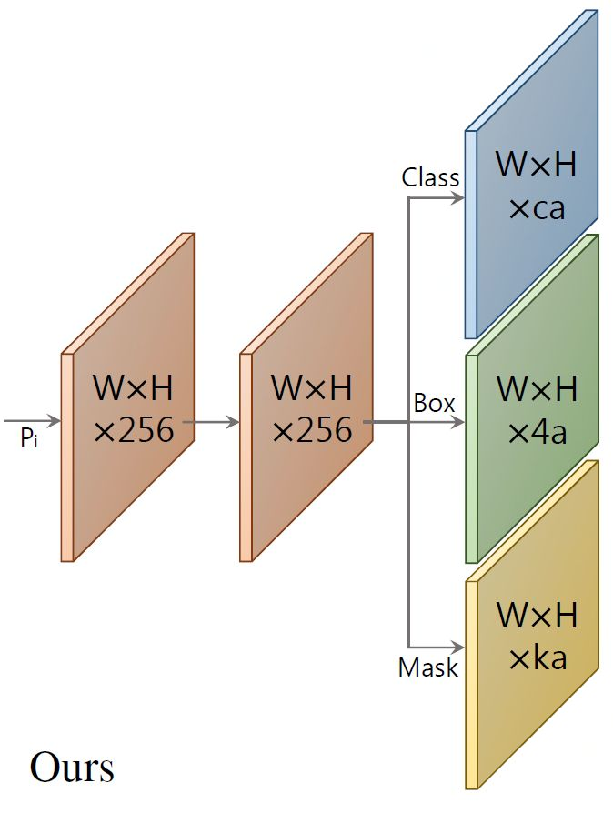
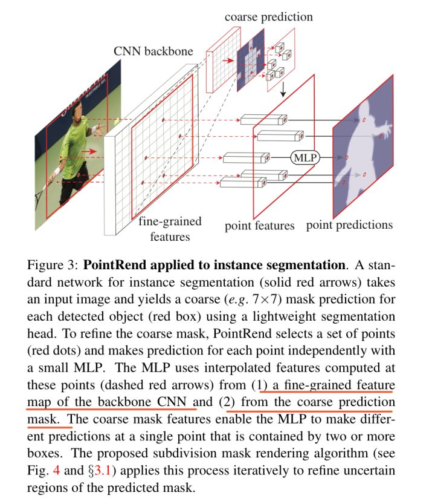
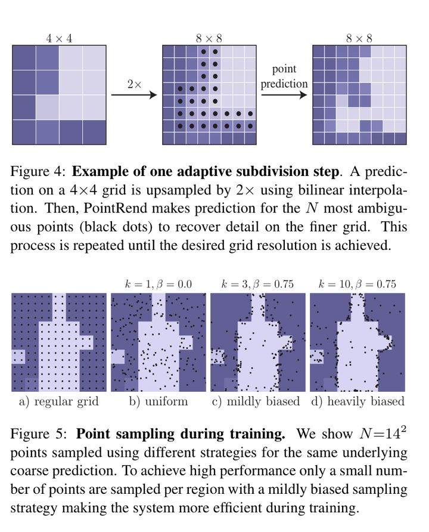

### 实例分割

#### YOLACT

  
 

  
 

  
 

原型生成（Prototype Generation）

掩膜系数（Mask Coefficients）

掩膜合成（Mask Assembly）

快速非极大值抑制（Fast NMS）

#### YOLACT++

#### PolarMask

#### SOLO

#### SOLO v2

#### PointRend

  
 

  
 

PointRend 方法要点总结来说是一个迭代上采样的过程：

while 输出的分辨率 < 图片分辨率：

对输出结果进行2倍双线性插值上采样得到 coarse prediction_i。

挑选出 N 个“难点”，即结果很有可能和周围点不一样的点（例如物体边缘）。

对于每个难点，获取其“表征向量”，“表征向量”由两个部分组成，其一是低层特征（fine-grained features），通过使用点的坐标，在低层的特征图上进行双线性插值获得（类似 RoI Align），其二是高层特征（coarse prediction），由步骤 1 获得。

使用 MLP 对“表征向量”计算得到新的预测，更新 coarse prediction_i 得到 coarse prediction_i+1。这个 MLP 其实可以看做一个只对“难点”的“表征向量”进行运算的由多个 conv1x1 组成的小网络

#### BlendMask

#### conv instance

