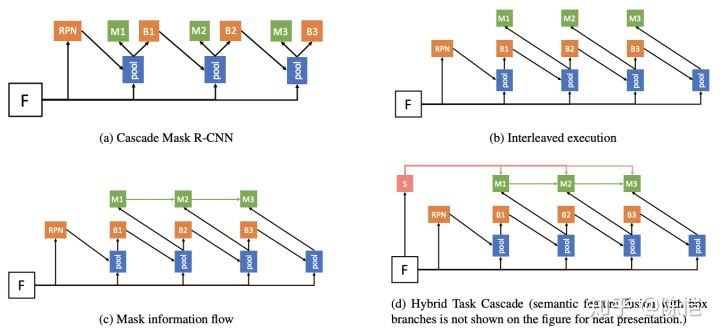
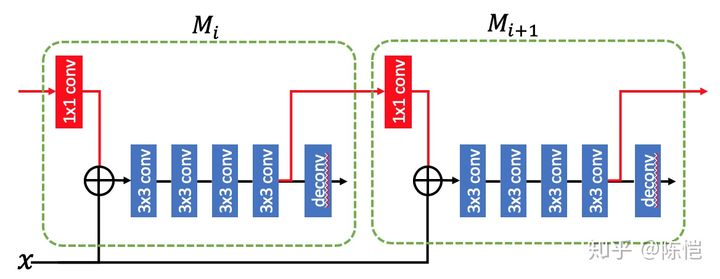
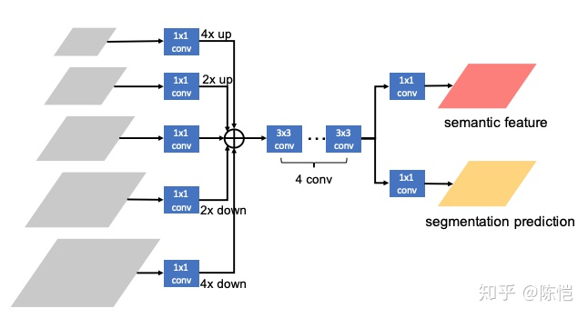
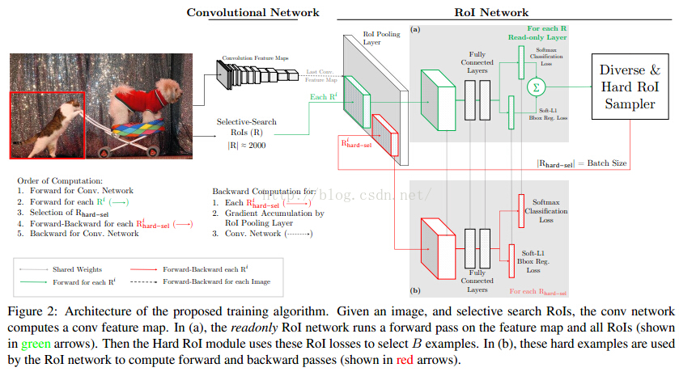
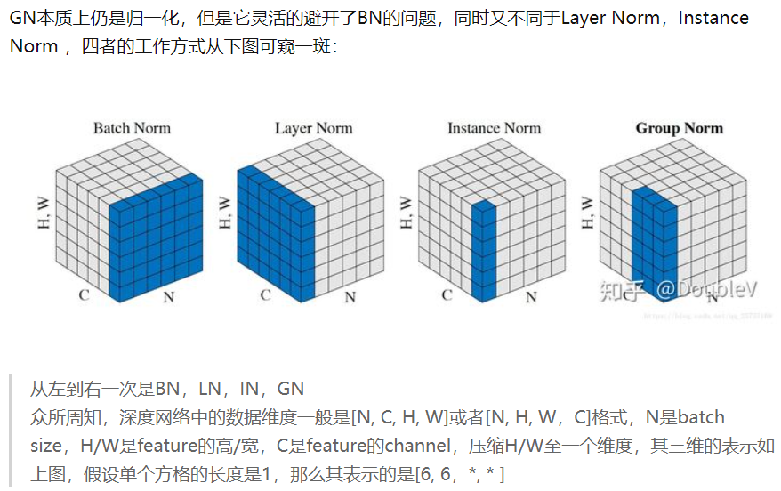
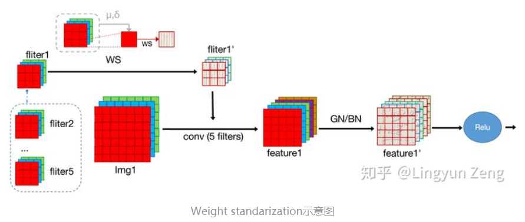
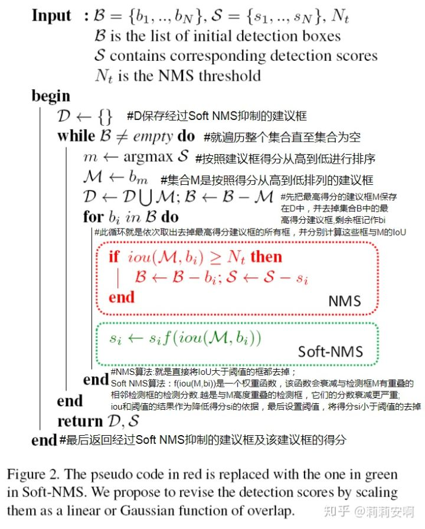

### 检测改进

###  RCNN改进

#### Cascade R-CNN

#### Hybrid Task Cascade

  
 

**Cascade Mask R-CNN**

子代 Cascade Mask R-CNN，在这种实现里，每一个 stage 和 Mask R-CNN 相似，都有一个 mask 分支 和 box 分支。当前 stage 会接受 RPN 或者 上一个 stage 回归过的框作为输入，然后预测新的框和 mask。

**Interleaved ExecutionCascade R-CNN** 

  
 

提出 Interleaved Execution，也即在每个 stage 里，先执行 box 分支，将回归过的框再交由 mask 分支来预测 mask

**Mask Information Flow**

**Semantic Feature Fusion**

  
 

在原始的 FPN 的基础上增加了一个简单的全卷积网络用来做语义分割。首先将 FPN 的 5 个 level 的特征图 resize 到相同大小并相加，然后经过一系列卷积，再分别预测出语义分割结果和语义分割特征

### 不均衡问题

#### OHEM

  
 

这个架构有两个相同 的RoI网络，不同的是其中一个只可读，另一个可读可写。我们看到(a) 是只可读的，只对所有RoI做前向计算，所以只需分配内存给前向计算 操作，(b)既可读也可写，对被选择的hard RoIs不仅做前向计算也做反向 传播计算。

对于一次SGD迭代，计算过程如下:

先计算出特征图，可读RoI网络对所有RoI执行前向计算并计算每个RoI的损失，然后选择hard RoIs。把这些hard RoIs输入到可读可写的RoI网络中执行前向前向计算和反向传播更新网络，并把可读可写的RoI网络的参数赋值给只可读的网络，一次 迭代就完成了。

#### GHM

#### Generalized Focal Loss

### 算子提升

#### DCNv2

##### 网络结构

#### RepPoints

##### 网络结构

#### Group Normalization

##### 网络结构

  
 

BN在batch的维度上norm，归一化维度为[N，H，W]，对batch中对应的channel归一化；

LN避开了batch维度，归一化的维度为[C，H，W]；

IN 归一化的维度为[H，W]；

而GN介于LN和IN之间，其首先将channel分为许多组（group），对每一组做归一化，及先将feature的维度由[N, C, H, W]reshape为[N, G，C//G , H, W]，归一化的维度为[C//G , H, W]

#### Weight Standardization

##### 网络结构

  
 

常见的normalization方式（e.g. BN,LN,IN,GN）都是从激活函数的输入来考虑，以不同的方式对激活函数的输入进行标准化；WS则想，我们这么费心费力地去处理卷积后的结果来加速训练，那为什么不直接去处理这个卷积的weight呢。

#### Mixed Precision (FP16) Training

##### 网络结构

### 新思考

#### Soft-NMS

##### 网络结构

  
 

soft-nms的核心就是降低置信度
