#### RetinaFace

#####网络结构

 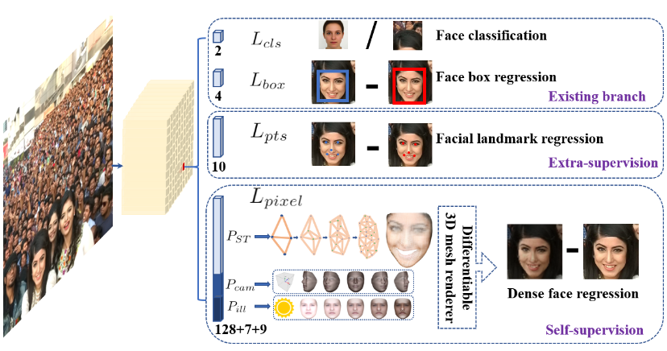 
 

 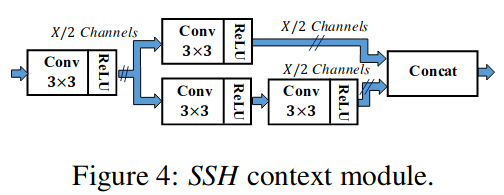 
 

 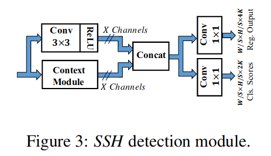 
 

人脸关键点的损失来辅助训练 + 一个所谓自监督学习的分支( 进行2D到3D的编码与解码，同时计算进行解码编码还原后的五个人脸关键点的损失)

**Dense Regression Branch**

将2D的人脸映射到3D模型上，再将3D模型解码为2D图片，然后计算经过编解码的图片和原始图片的差别。中间用到了图卷积

ResNet152的金字塔结构，对于每一层金字塔都有特定的Anchor Setting，据说这样可以捕捉到不同的信息， 

P2用于设置为捕微小人脸的功能。中间还使用了OHEM来平衡positive 和negative的anchors，因为negative anchors的数量明显要多。同时对小人脸数据集做了Resize以增量训练

上下文模块的作用： 扩张预检测区域的上下文信息。上下文模块和conv结合组成了一个检测模块

SSH网络的检测模块：将一个上下文模块与conv叠加后生成分类头和回归头得到网络的输出

#### 人脸识别loss 

#### 原理 

triplet loss 

 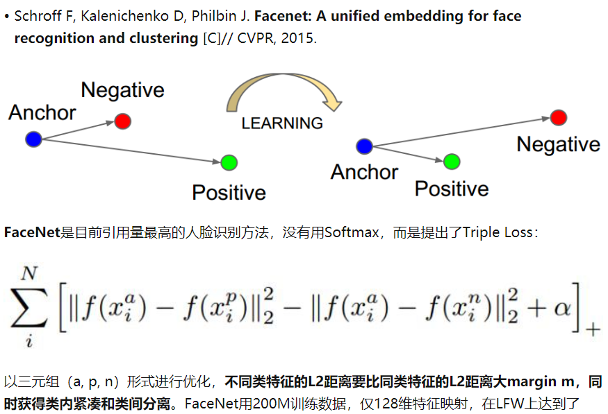 
 

center loss 

 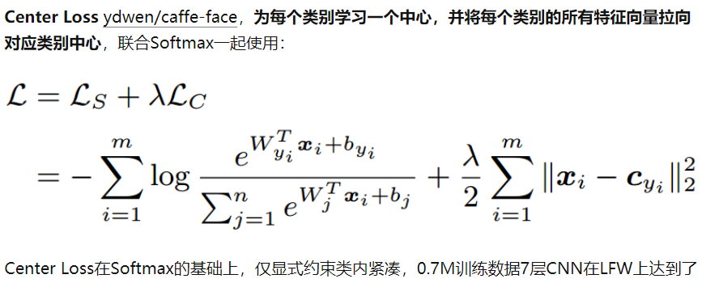 
 

Large-Margin Softmax

 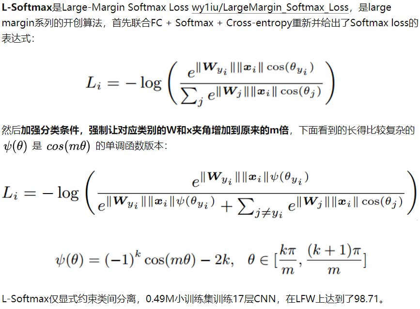 
 

SphereFace 

 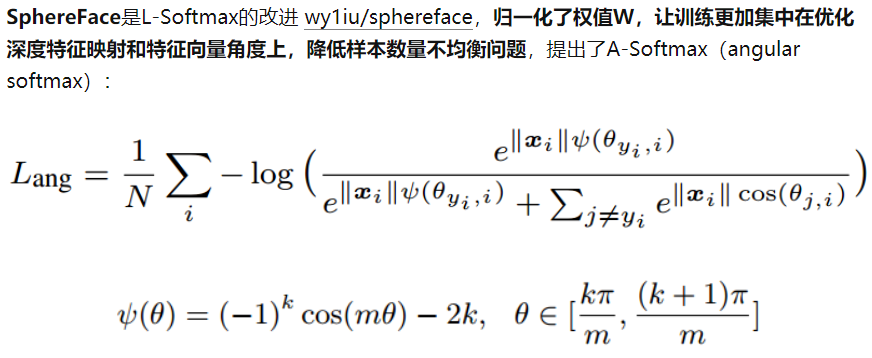 
 

**特征归一化的重要性**

从最新方法来看，权值W和特征f(或x)归一化已经成为了标配，而且都给归一化特征乘以尺度因子s进行放大，目前主流都采用固定尺度因子s的方法(看来自适应训练没那么重要)；

权值和特征归一化使得CNN更加集中在优化夹角上，得到的深度人脸特征更加分离；

特征归一化后，特征向量都固定映射到半径为1的超球上，便于理解和优化；但这样也会压缩特征表达的空间；乘尺度因子s，相当于将超球的半径放大到s，超球变大，特征表达的空间也更大（简单理解：半径越大球的表面积越大）；

特征归一化后，人脸识别计算特征向量相似度，L2距离和cos距离意义等价，计算量也相同，我们再也不用纠结到底用L2距离还会用cos距离：

 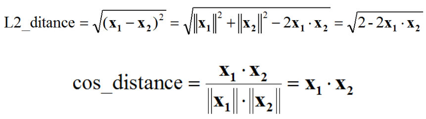 
 

 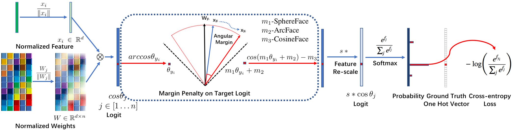 
 

CosineFace

ArcFace

 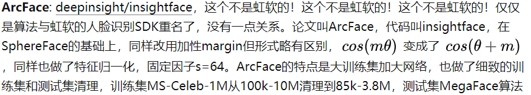 
 

#### PFLD

##### 网络结构

 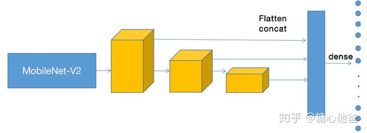 
 

 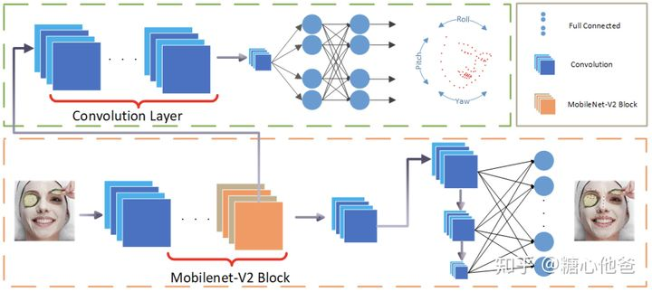 
 

融合三个不同尺度的特征,网络结构骨干部分采用的是Mobilenet-v2

**损失函数设计**

 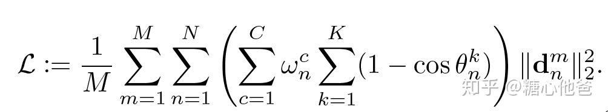 
 

wn为可调控的权值函数（针对不同的情况选取不同的权值，如正常情况、遮挡情况、暗光情况等等），theta为人脸姿态的三维欧拉角（K=3），d为回归的landmark和groundtrue的度量（一般情况下为MSE，也可以选L1度量）

设计的目的是，对于样本量比较大的数据（如正脸，即欧拉角都相对较小的情况），给予一个小的权值，在进行梯度的反向传播的时候，对模型训练的贡献小一些；对于样本量比较少的数据（侧脸、低头、抬头、表情极端），给予一个较大的权值。

**配合训练的子网络**

 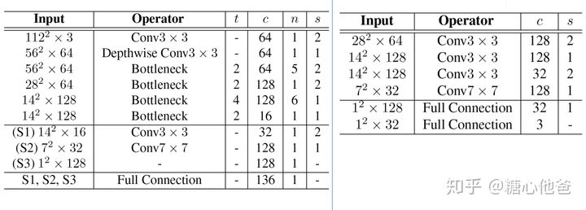 
 